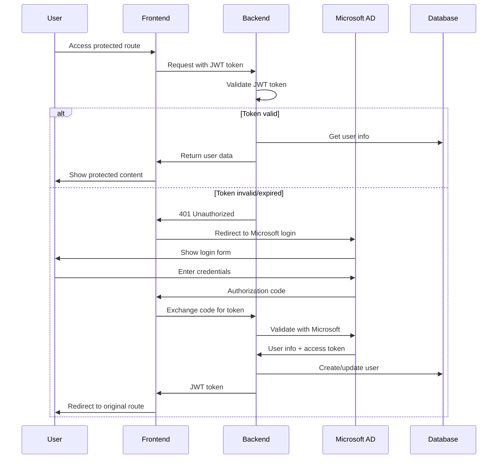
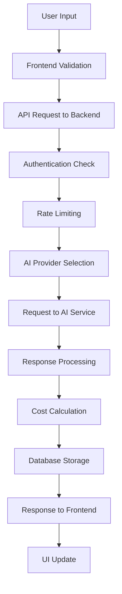
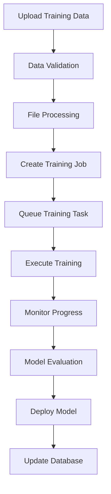

# AI Gateway - Technical Architecture

**Version**: 0.2.11  
**Last Updated**: August 27, 2025

## 🏗️ System Overview

The AI Gateway is a microservices-based architecture designed for enterprise AI service management, providing secure access to multiple AI providers while maintaining data sovereignty and compliance requirements.

## 🏛️ High-Level Architecture

```
┌─────────────────┐    ┌─────────────────┐    ┌─────────────────┐
│   Frontend      │    │    Backend      │    │   External      │
│   (Next.js)     │◄──►│   (FastAPI)     │◄──►│   AI Services   │
│                 │    │                 │    │                 │
│ • React 18      │    │ • Python 3.11+  │    │ • OpenAI        │
│ • TypeScript    │    │ • FastAPI       │    │ • Anthropic     │
│ • Tailwind CSS  │    │ • SQLAlchemy    │    │ • Custom Models │
│ • shadcn/ui     │    │ • Pydantic      │    │                 │
└─────────────────┘    └─────────────────┘    └─────────────────┘
         │                       │                       │
         │                       │                       │
         ▼                       ▼                       ▼
┌─────────────────┐    ┌─────────────────┐    ┌─────────────────┐
│   Database      │    │   Cache &       │    │   Monitoring    │
│   (PostgreSQL)  │    │   Message Queue │    │   & Analytics   │
│                 │    │                 │    │                 │
│ • Main DB       │    │ • Redis         │    │ • Prometheus    │
│ • Vector Store  │    │ • Celery        │    │ • Grafana       │
│ • TimescaleDB   │    │ • RabbitMQ      │    │ • ELK Stack     │
└─────────────────┘    └─────────────────┘    └─────────────────┘
```

## 🔧 Technology Stack

### Frontend Layer
- **Framework**: Next.js 14 (App Router)
- **Language**: TypeScript 5.0+
- **UI Library**: React 18 with hooks
- **Styling**: Tailwind CSS + shadcn/ui
- **State Management**: React Context + Zustand
- **Build Tool**: Turbopack (Next.js built-in)

### Backend Layer
- **Framework**: FastAPI (Python 3.11+)
- **ORM**: SQLAlchemy 2.0+ (async)
- **Validation**: Pydantic v2
- **Authentication**: Microsoft OIDC + JWT
- **API Documentation**: OpenAPI 3.1 + Swagger UI

### Data Layer
- **Primary Database**: PostgreSQL 16+
- **Vector Database**: pgvector extension
- **Time Series**: TimescaleDB extension
- **Cache**: Redis 7+
- **Migration**: Alembic

### Infrastructure
- **Containerization**: Docker + Docker Compose
- **Reverse Proxy**: Nginx
- **Process Management**: PM2 (Node.js) + Supervisor (Python)
- **Load Balancing**: Nginx upstream

## 🏢 Service Architecture

### Core Services

#### 1. Authentication Service
```python
# Location: backend/app/core/auth.py
class AuthService:
    - Microsoft OIDC integration
    - JWT token management
    - Role-based access control (RBAC)
    - Session management
```

#### 2. AI Gateway Service
```python
# Location: backend/app/core/ai_gateway.py
class AIGatewayService:
    - Multi-provider routing
    - Rate limiting
    - Cost tracking
    - Response caching
```

#### 3. Chat Service
```python
# Location: backend/app/core/chat.py
class ChatService:
    - Thread management
    - Message history
    - Context preservation
    - Streaming responses
```

#### 4. Training Service
```python
# Location: backend/app/core/training.py
class TrainingService:
    - Model fine-tuning
    - Dataset management
    - Training job orchestration
    - Model deployment
```

### API Layer Structure

```
/api/v1/
├── auth/           # Authentication endpoints
├── chat/           # Chat and conversation management
├── assistants/     # AI assistant configuration
├── training/       # Model training and fine-tuning
├── analytics/      # Usage analytics and metrics
├── admin/          # Administrative functions
├── settings/       # User and system settings
└── health/         # Health checks and monitoring
```

## 🗄️ Database Design

### Core Tables

#### Users & Authentication
```sql
-- Users table
CREATE TABLE users (
    id UUID PRIMARY KEY DEFAULT gen_random_uuid(),
    ext_subject VARCHAR(255) UNIQUE NOT NULL,  -- Microsoft AD subject
    display_name VARCHAR(255),
    email VARCHAR(255),
    role VARCHAR(50) DEFAULT 'user',
    department VARCHAR(100),
    created_at TIMESTAMP DEFAULT NOW(),
    updated_at TIMESTAMP DEFAULT NOW()
);

-- User sessions
CREATE TABLE user_sessions (
    id UUID PRIMARY KEY DEFAULT gen_random_uuid(),
    user_id UUID REFERENCES users(id),
    session_token VARCHAR(255) UNIQUE NOT NULL,
    expires_at TIMESTAMP NOT NULL,
    created_at TIMESTAMP DEFAULT NOW()
);
```

#### AI Assistants
```sql
-- AI assistants configuration
CREATE TABLE assistants (
    id UUID PRIMARY KEY DEFAULT gen_random_uuid(),
    name VARCHAR(255) NOT NULL,
    provider VARCHAR(50) NOT NULL,  -- 'openai', 'anthropic', 'custom'
    model VARCHAR(100) NOT NULL,
    instructions TEXT,
    dept_scope TEXT[],  -- Array of department IDs
    openai_id VARCHAR(255),  -- OpenAI assistant ID
    created_at TIMESTAMP DEFAULT NOW(),
    updated_at TIMESTAMP DEFAULT NOW()
);
```

#### Chat System
```sql
-- Chat threads
CREATE TABLE chat_threads (
    id UUID PRIMARY KEY DEFAULT gen_random_uuid(),
    title VARCHAR(255),
    user_id UUID REFERENCES users(id),
    assistant_id UUID REFERENCES assistants(id),
    created_at TIMESTAMP DEFAULT NOW(),
    updated_at TIMESTAMP DEFAULT NOW()
);

-- Chat messages
CREATE TABLE chat_messages (
    id UUID PRIMARY KEY DEFAULT gen_random_uuid(),
    thread_id UUID REFERENCES chat_threads(id),
    role VARCHAR(20) NOT NULL,  -- 'user', 'assistant', 'system'
    content TEXT NOT NULL,
    tokens_used INTEGER,
    cost_cents INTEGER,
    created_at TIMESTAMP DEFAULT NOW()
);
```

#### Training & Fine-tuning
```sql
-- Training jobs
CREATE TABLE training_jobs (
    id UUID PRIMARY KEY DEFAULT gen_random_uuid(),
    name VARCHAR(255) NOT NULL,
    model_name VARCHAR(100) NOT NULL,
    status VARCHAR(50) DEFAULT 'pending',
    training_file_id VARCHAR(255),
    hyperparameters JSONB,
    metrics JSONB,
    created_at TIMESTAMP DEFAULT NOW(),
    updated_at TIMESTAMP DEFAULT NOW()
);

-- Training datasets
CREATE TABLE training_datasets (
    id UUID PRIMARY KEY DEFAULT gen_random_uuid(),
    name VARCHAR(255) NOT NULL,
    description TEXT,
    file_path VARCHAR(500),
    metadata_json JSONB,
    created_at TIMESTAMP DEFAULT NOW()
);
```

## 🔐 Security Architecture

### Authentication Flow



### Authorization Model

```python
# Role-based access control
ROLES = {
    'user': {
        'permissions': ['chat', 'view_assistants', 'view_analytics'],
        'scope': 'own_data'
    },
    'admin': {
        'permissions': ['*'],
        'scope': 'all_data'
    },
    'department_admin': {
        'permissions': ['chat', 'manage_assistants', 'view_analytics'],
        'scope': 'department_data'
    }
}
```

## 📊 Data Flow

### Chat Request Flow



### Training Pipeline



## 🚀 Performance Considerations

### Caching Strategy
- **Redis Cache**: API responses, user sessions, rate limiting
- **Browser Cache**: Static assets, API responses
- **Database Query Cache**: Frequently accessed data

### Database Optimization
- **Indexing**: User lookups, chat history, analytics queries
- **Connection Pooling**: Async database connections
- **Query Optimization**: Efficient SQL queries with proper joins

### Frontend Performance
- **Code Splitting**: Route-based and component-based splitting
- **Image Optimization**: Next.js Image component with WebP/AVIF
- **Bundle Analysis**: Regular bundle size monitoring

## 🔍 Monitoring & Observability

### Metrics Collection
- **Application Metrics**: Response times, error rates, throughput
- **Business Metrics**: User engagement, AI usage, costs
- **Infrastructure Metrics**: CPU, memory, disk, network

### Logging Strategy
- **Structured Logging**: JSON format with correlation IDs
- **Log Levels**: DEBUG, INFO, WARNING, ERROR, CRITICAL
- **Log Aggregation**: Centralized logging with search capabilities

### Alerting
- **Performance Alerts**: High response times, error rates
- **Business Alerts**: Cost thresholds, usage anomalies
- **Infrastructure Alerts**: Resource utilization, service health

## 🧪 Testing Strategy

### Test Pyramid
```
        /\
       /  \     E2E Tests (Few)
      /____\    
     /      \   Integration Tests (Some)
    /________\  
   /          \  Unit Tests (Many)
  /____________\
```

### Testing Tools
- **Backend**: pytest, pytest-asyncio, pytest-cov
- **Frontend**: Jest, React Testing Library, Playwright
- **API**: pytest-httpx, pytest-mock
- **Database**: pytest-postgresql, testcontainers

## 🚢 Deployment Strategy

### Environment Management
- **Development**: Local development with hot reload
- **Staging**: Production-like environment for testing
- **Production**: Optimized, monitored, and secured

### Deployment Pipeline
```yaml
# GitHub Actions workflow
name: Deploy AI Gateway
on:
  push:
    branches: [main, develop]
  pull_request:
    branches: [main]

jobs:
  test:
    - Run tests
    - Code quality checks
    - Security scanning
  
  build:
    - Build Docker images
    - Run integration tests
    - Generate artifacts
  
  deploy:
    - Deploy to staging/production
    - Run smoke tests
    - Monitor deployment
```

## 🔄 Versioning & Release Management

### Semantic Versioning
- **Major**: Breaking changes, major features
- **Minor**: New features, backward compatible
- **Patch**: Bug fixes, security updates

### Release Process
1. **Development**: Feature development in feature branches
2. **Testing**: Integration testing in develop branch
3. **Staging**: Pre-production testing
4. **Production**: Tagged release deployment
5. **Monitoring**: Post-deployment monitoring

## 📚 API Design Principles

### RESTful Design
- **Resource-based URLs**: `/api/v1/assistants/{id}`
- **HTTP Methods**: GET, POST, PUT, DELETE, PATCH
- **Status Codes**: Proper HTTP status codes
- **Pagination**: Consistent pagination for list endpoints

### Response Format
```json
{
  "success": true,
  "data": {
    // Response data
  },
  "message": "Operation completed successfully",
  "error": null,
  "meta": {
    "pagination": {
      "page": 1,
      "per_page": 20,
      "total": 100
    }
  }
}
```

### Error Handling
```json
{
  "success": false,
  "data": null,
  "message": "Validation failed",
  "error": "INVALID_INPUT",
  "details": [
    {
      "field": "email",
      "message": "Invalid email format"
    }
  ]
}
```

## 🔧 Configuration Management

### Environment Configuration
```python
# Configuration hierarchy
class Settings(BaseSettings):
    # Environment variables
    DATABASE_URL: str
    OPENAI_API_KEY: str
    
    # Default values
    DEBUG: bool = False
    LOG_LEVEL: str = "INFO"
    
    # Computed values
    @property
    def is_production(self) -> bool:
        return not self.DEBUG
```

### Feature Flags
```python
# Feature toggle system
FEATURE_FLAGS = {
    'advanced_analytics': True,
    'custom_models': False,
    'beta_features': False
}
```

## 🔮 Future Architecture Considerations

### Scalability
- **Horizontal Scaling**: Multiple backend instances
- **Database Sharding**: Partition data by tenant/department
- **CDN Integration**: Global content delivery
- **Microservices**: Break down into smaller services

### Advanced Features
- **Real-time Communication**: WebSocket support
- **Event Sourcing**: Audit trail and event replay
- **CQRS**: Command Query Responsibility Segregation
- **GraphQL**: Alternative to REST API

### Integration Capabilities
- **Webhook System**: External system notifications
- **API Gateway**: Rate limiting and authentication
- **Message Queues**: Asynchronous processing
- **Event Bus**: Inter-service communication

---

**Document Version**: 0.2.11  
**Last Updated**: August 27, 2025  
**Maintainer**: Development Team
